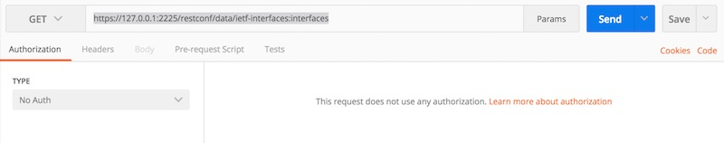
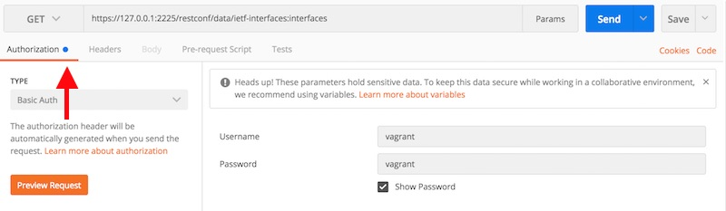
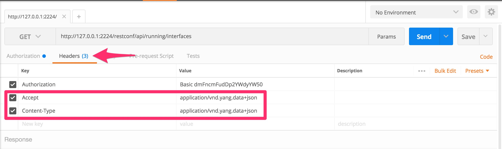
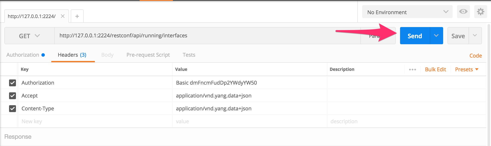
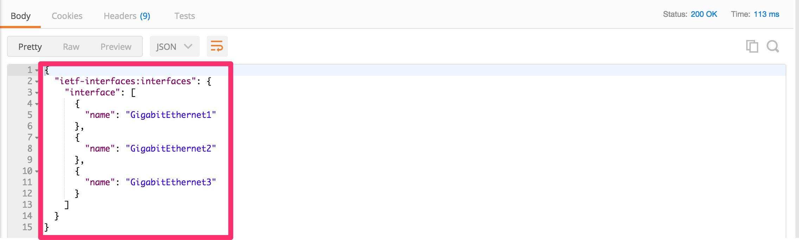
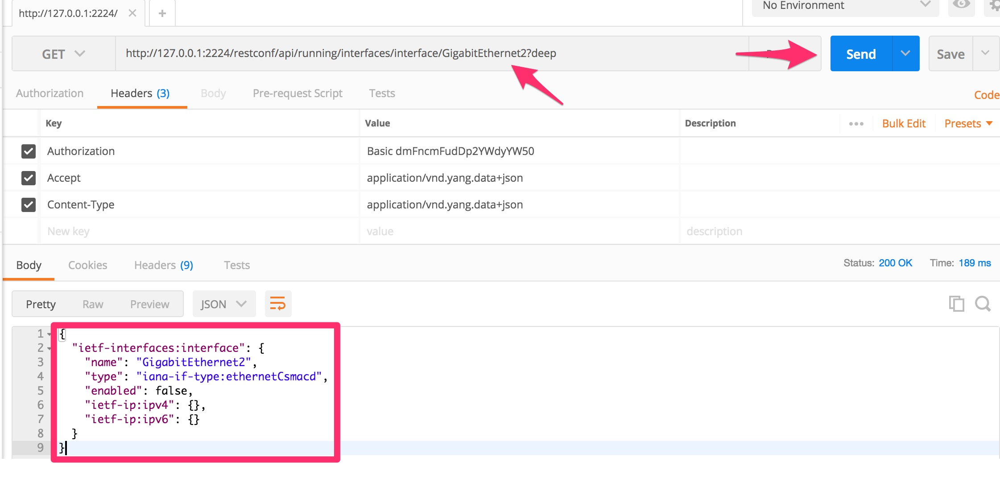
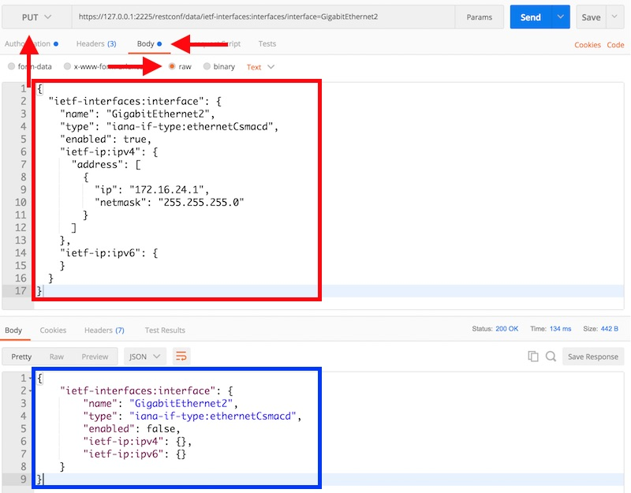

# DEVNET-2585 - Hands on Kicking the Tires of RESTCONF

### Table of Contents
- [Introduction](DEVNET-2585-Intro.md)
- [Module 1 - Exploring the YANG Data Model](DEVNET-2585-M1.md)
- [Module 2 - Building the RESTCONF URI](DEVNET-2585-M2.md)
- [Module 3 - Using POSTMAN to Send RESTCONF](DEVNET-2585-M3.md)
- [Module 4 - Using Python to Send RESTCONF](DEVNET-2585-M4.md)
- [Closing](DEVNET-2585-Close.md)

### Objectives
1. Use Postman to send RESTCONF.
2. Use Postman to modify the router configuration.

In the previous module we used `curl` to send REST API calls to our router and view various outputs. While curl is a useful tool for making basic calls it can become unwieldy if you need to send data, like a JSON formatted configuration, to the device. In these examples we will use the tool `Postman` to view and modify the router configuration.

## Module 3.1 - Making a RESTCONF Call with Postman

**NOTE** - In the next set of examples we are using screen shots rather than highlighted text to represent configuration. The red arrows should point out where to make changes in the UI.

First we will set up the basics of our API calls.

- To start select `GET` from the drop down and enter the following URI into the field

```
http://127.0.0.1:2224/restconf/api/running/interfaces 
```

- Select `GET` from the drop down and enter the URI `http://127.0.0.1:2224/restconf/api/running/interfaces`
<br>
<br>


<br>
<br>
- On the `Authorization` tab
	- Select `Basic Auth` from the drop down.
	- Use `vagrant` as both the username and password.
	- Click `Update Request` the button is the same but the context may change.
<br>
<br>



<br>
<br> 
- On the Headers tab add two headers under `Authorization`
	- Header `Accept` with a value of `application/vnd.yang.data+json`
	- Header `Content-Type` with a value of `application/vnd.yang.data+json`
<br>
<br>



<br>
<br> 
- Click `Send` to submit the RESTCONF request to the router and review the ouput
<br>
<br> 



<br>
<br> 



<br>
<br> 

## Module 3.2 - Using RESTCONF to Update Device Configuration

Now that we understand how to use Postman to make RESTCONF requests to the router let's step through assigning some configuration details to interface. In this example we will assign an ip address and put the interface into an admin up state.


* First let's pull the status of interface Gigabit 2 on the router.
	* Remember back to the previous exercise. We will need to craft the URI as follows:
	* `http://127.0.0.1:2224/restconf/api/running/interfaces/interface/GigabitEthernet2?deep`
	* Once you've entered the URI send the command

<br>
<br>



<br>
<br> 
Using this data we can craft our JSON payload to specify the IP address, intefface description, and enable the interface. There are two options for building the JSON we will send to the router. The first is to run a GET on interface G3 and copy the output and modify the interface name to `GigabitEthernet2` The other option is to follow along below:

- First change the drop down next to the URI from `GET` to `PUT` 
- Select the `Body` tab and select and paste the contents of the lower box (in blue below) into the upper box.

<br>
<br>



<br>
<br> 

- Supply the following values to make what's in the screen shot
	- Set the value of `enabled` to `true`
	- Set the value of `ietf-ip:ipv4` to 172.16.24.1 with a netmask of `255.255.255`

Optionally you can just paste the following contents into the area marked in red on Postman.

```
{
  "ietf-interfaces:interface": {
    "name": "GigabitEthernet2",
    "type": "iana-if-type:ethernetCsmacd",
    "enabled": true,
    "ietf-ip:ipv4": {
      "address": [
        {
          "ip": "172.16.24.1",
          "netmask": "255.255.255.0"
        }
      ]
    },
    "ietf-ip:ipv6": {
    }
  }
}
```
One the details have been filled in send the RESTCONF to the router and re run the `GET` request from earlier to validate that the changes have been made.


### [Continue to Module 4](DEVNET-2585-M4.md) - Using Python to Send RESTCONF