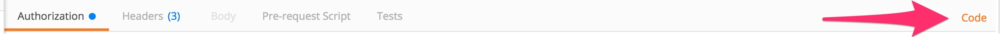
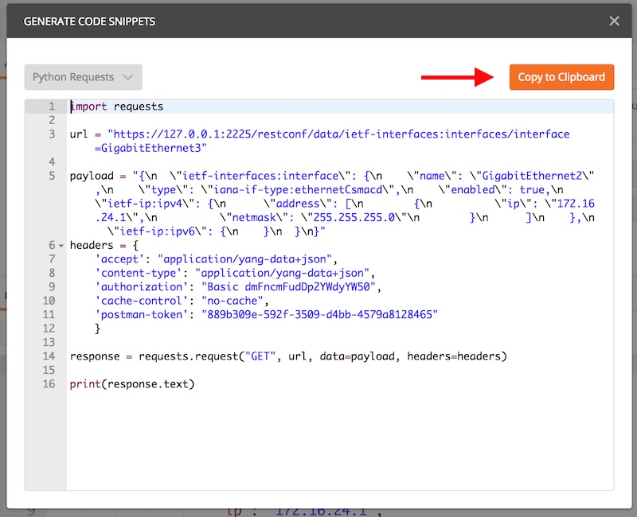

# DEVNET-2585 - Hands on Kicking the Tires of RESTCONF

### Table of Contents
- [Introduction](DEVNET-2585-Intro.md)
- [Module 1 - Exploring the YANG Data Model](DEVNET-2585-M1.md)
- [Module 2 - Building the RESTCONF URI](DEVNET-2585-M2.md)
- [Module 3 - Using POSTMAN to Send RESTCONF](DEVNET-2585-M3.md)
- [Module 4 - Using Python to Send RESTCONF](DEVNET-2585-M4.md)
- [Closing](DEVNET-2585-Close.md)

### Objectives

1. Use Postman to generate a Python script.
2. Use Python to modify the router configuration.

## Module 4.1 - Using Postman to Generate Python

As we discussed at the start of the lab one of the rests RESTCONF has had fast adoption is the relative ease of use due to the number of tools available. One of the additional benefits of Postman is the ability to generate code based off the REST call made in the UI. 

Let's jump into Postman and generate our code. First let's modify the previous `GET` to retrieve the configuration of interface Gigabit 3. The URI will be

`http://127.0.0.1:2224/restconf/api/running/interfaces/interface/GigabitEthernet3?deep`

***DO NOT HIT SEND***

***DO NOT HIT SEND***

On the right hand side of the screen there is a button labeled `Code`. Click it.

<br>
<br>



<br>
<br>
This will generate the python code we will modify in our terminal. Let's click `Copy to Clipboard` before we proceed.

<br>
<br>



<br>
<br>


Now that we have a copy of our base Python code let's open up a file in our terminal and paste in the contents.

**From the terminal window please enter the following:**

```
nano test-python.py
```

After the file opens you can paste the contents. If you are not familiar with a Mac please use `cmd+V`. Save the file by hitting `ctrl+x` and responding with `y` when prompted.

After creating your python script run it with the following.

**From the terminal window please enter the following:**

```
python test-python.py
```

You should see the following sent back:

```
{
  "ietf-interfaces:interface": {
    "name": "GigabitEthernet3",
    "description": "**THIS IS INTERFACE 3",
    "type": "iana-if-type:ethernetCsmacd",
    "enabled": true,
    "ietf-ip:ipv4": {
      "address": [
        {
          "ip": "192.168.185.1",
          "netmask": "255.255.255.0"
        }
      ]
    },
    "ietf-ip:ipv6": {
    }
  }
}
```


### [Continue to Closing](DEVNET-2585-Close.md)