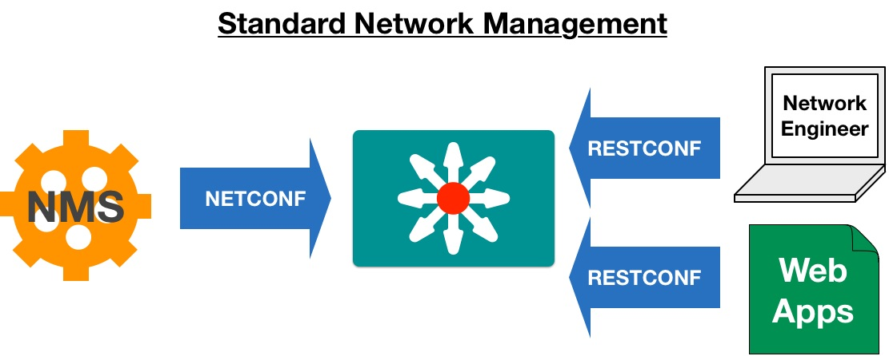

# DEVNET-2585 - Hands On Kicking the Tires of RESTCONF

###Table of Contents
- [Initial Workstation Prep](DEVNET-2585-Guide.md)
- [A Brief Introduction to RESTCONF](restconf-intro.md)
- [Building the RESTCONF URI](restconf-lab.md)
- [Using POSTMAN to Send RESTCONF](postman-lab.md)
- [Conclusion](conclusion.md)
- [Lab Clean Up](cleanup.md)

## Objective

Completion Time: 15 Minutes

* Understand the RESTCONF Protocol, and its basic usage
* Understand the relationship between RESTCONF and YANG Data Models in building API calls
* Understand the basics of making RESTCONF API calls to retrieve and update device configuration

## Using RESTCONF to Update Device Configuration

In this example, we will use *Postman*, the Chrome Browser add-on to make RESTCONF calls to update device configuration details.  

---

***Some of the images may have different Address and/or Credentials displayed.  Be sure to enter the correct credentials for the target environment***

* **Device Address:** 127.0.0.1:2224
* **Username:** vagrant
* **Password:** vagrant

---

With Postman setup for making RESTCONF reqeust to the CSR update the URI to get a "deep" look at both the GigabitEthernet3 and GigabitEthernet3 interface.

- Select `GET` from the drop down and enter the URI `http://127.0.0.1:2224/restconf/api/running/interfaces`
<br>
<br>

<br>
<br>
- On the `Authorization` tab
	- Select `Basic Auth` from the drop down.
	- Use `vagrant` as both the username and password.
	- Click `Update Request` the button is the same but the context may change.
<br>
<br>

<br>
<br> 
- On the Headers tab add two headers under `Authorization`
	- Header `Accept` with a value of `application/vnd.yang.data+json`
	- Header `Content-Type` with a value of `application/vnd.yang.data+json`
<br>
<br>

<br>
<br> 
- Click `Send` to submit the RESTCONF request to the router and review the ouput
<br>
<br> 

<br>
<br> 

<br>
<br> 
With our basic Postman setup complete we can now edit the URI field to modify the data we pull from the router. Let's go ahead and modify the URI to pull a 'deep' view of the interface configuration.


## Making Changes with RESTCONF

Now that we understand how to make RESTCONF requests to the router let's step through assigning some configuration details to interface. In this example we will assign an ip address and put the interface into an admin up state.

* First let's pull the status of interface Gigabit 2 on the router.
	* Remember back to the previous exercise. We will need to craft the URI as follows:
	* `http://127.0.0.1:2224/restconf/api/running/interfaces/interface/GigabitEthernet2?deep`
	* Once you've entered the URI send the command

<br>
<br>

<br>
<br> 
Using this data we can craft our JSON payload to specify the IP address, intefface description, and enable the interface. There are two options for building the JSON we will send to the router. The first is to run a GET on interface G3 and copy the output and modify the interface name to `GigabitEthernet2` The other option is to follow along below:

- First change the drop down next to the URI from `GET` to `PUT` 
- Select the `Body` tab and select and paste the contents of the lower box (in blue below) into the upper box.

<br>
<br>

<br>
<br> 

- Supply the following values to make what's in the screen shot
	- Set the value of `enabled` to `true`
	- Set the value of `ietf-ip:ipv4` to 172.16.24.1 with a netmask of `255.255.255`

Optionally you can just paste the following contents into the area marked in red on Postman.

```
{
  "ietf-interfaces:interface": {
    "name": "GigabitEthernet2",
    "type": "iana-if-type:ethernetCsmacd",
    "enabled": true,
    "ietf-ip:ipv4": {
      "address": [
        {
          "ip": "172.16.24.1",
          "netmask": "255.255.255.0"
        }
      ]
    },
    "ietf-ip:ipv6": {
    }
  }
}
```
One the details have been filled in send the RESTCONF to the router and re run the `GET` request from earlier to validate that the changes have been made.

## Converting Postman to Python

While Postman is an effective tool for generating RESTCONF but it's not very practical for large scale scripting. If we wanted to push a change out a large number of devices we would likely use Python, or some other scripting tool, to make wide scale changes. 

One of the benefits of prototyping with Postman is the ease in which you can convert RESTCONF into Python. It's as simple as clicking the `Code` button in the UI.

<br>
<br>

<br>
<br>

In this example we will pull the configuration of interface Gig 3 with Postman, convert the RESTCONF call to Python and create a script to run locally in our terminal.

First modify the previous `Get` command to call interface Gigabit 3. The URI will be:
- `http://127.0.0.1:2224/restconf/api/running/interfaces/interface/GigabitEthernet3?deep`
- ***DO NOT HIT SEND*** instead click the `Code` option
- Change the drop down to `Python Requests` and select `Copy to Clipboard`
- From your terminal enter the following commands:

```
nano test-py.py

```
Now paste the copied code from Postman into the terminal. Exit and save the document with `Ctrl+X`

Out code is now ready to execute.

```
python test-py.py
```

Our response should match the output below.

```
{
  "ietf-interfaces:interface": {
    "name": "GigabitEthernet3",
    "description": "**THIS IS INTERFACE 3**",
    "type": "iana-if-type:ethernetCsmacd",
    "enabled": true,
    "ietf-ip:ipv4": {
      "address": [
        {
          "ip": "192.168.185.1",
          "netmask": "255.255.255.0"
        }
      ]
    },
    "ietf-ip:ipv6": {
    }
  }
}
```

## RESTCONF Lab Review



In this lab, we looked at how RESTCONF extends NETCONF to provide a modern REST-like interface for NETWORK management while maintaining the benefits of YANG Data Models.  

RESTCONF is a **very** new standard, RFC8040 in January 2017, so many devices may have implementations still based from earlier drafts.  Be sure to look at documentation for any device when working with a new device. 


### Continue - [Conclusion](conclusion.md)